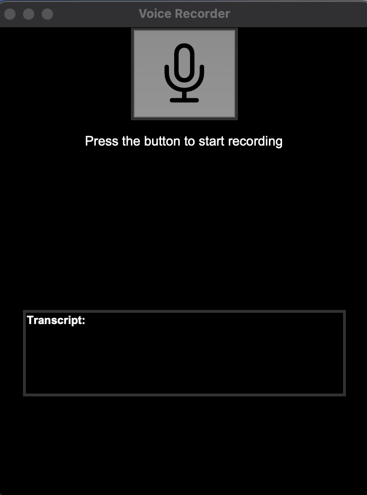
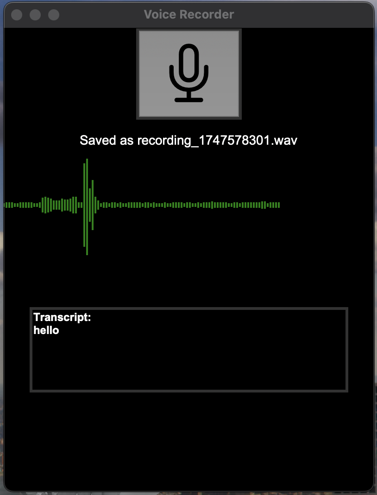

🎙️ Voice Recorder GUI with Real-Time Transcription

This is a fully functional, cross-platform voice recording app with a graphical interface built using **Python**. It includes real-time **speech-to-text transcription**, live waveform visualization, and `.wav` file saving — all wrapped in a sleek, interactive Tkinter UI.

## ⚡ Features

- 🎤 Record your voice with one click
- 📈 Live waveform visual feedback while recording
- 🧠 Real-time speech transcription using **Vosk**
- 💾 Auto-saves each recording as a `.wav` file
- 🖼️ Simple, dark-themed GUI built with **Tkinter**
- 🔄 Multithreaded — no freezing while recording or transcribing

---

## 🛠️ Tech Stack

| Tech           | Purpose                          |
|----------------|----------------------------------|
| **Python**     | Core language                    |
| **Tkinter**    | GUI interface                    |
| **PyAudio**    | Audio input stream               |
| **NumPy**      | Processing waveform visuals      |
| **Vosk**       | Speech-to-text engine (offline)  |
| **Wave**       | Save audio as `.wav` format      |
| **Threading**  | Run recorder + transcription in parallel |

## 📸 Screenshots

### 🎤 Main GUI

### 🔊 Recording in Progress

